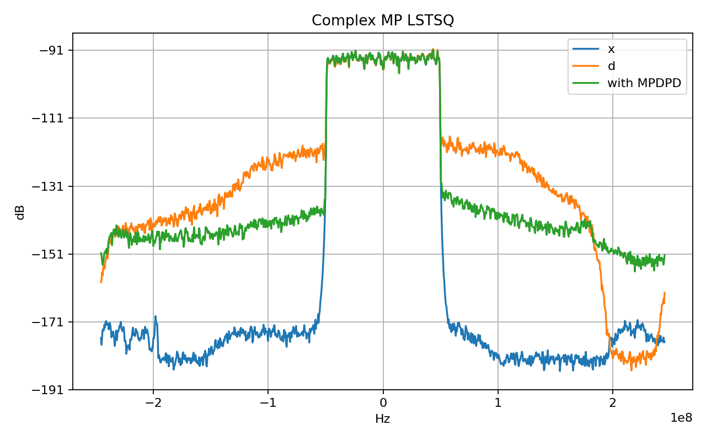
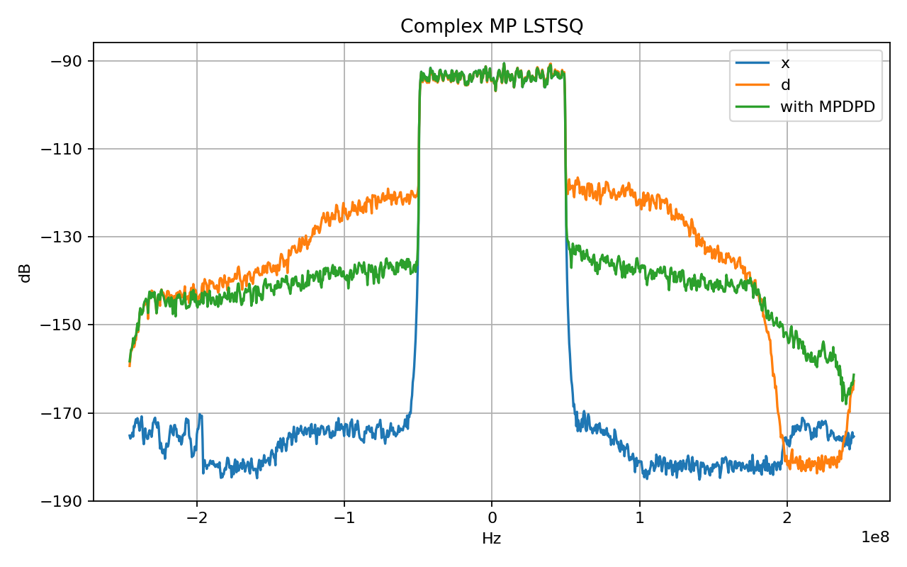

# Nonlinear NN Agent Harness

面向 Agent Harness / Runtime / Agent Coding 岗位的实验型项目。

这个项目把一个真实的非线性系统建模任务，改造成 LLM-driven Agent Harness。LLM 负责根据目标和历史结果设计下一轮实验，Harness 负责受控工具调用、schema guard、参数预算检查、训练执行、指标验证、trace/session、上下文压缩、reflection、benchmark 和结果落盘。

核心目标不是只把 NMSE 调低，而是证明自己理解并实现过一个 Agent Runtime 应该具备的工程能力。

## 1. 项目定位

一句话：

> An LLM-driven Agent Harness Runtime for nonlinear-system modeling experiments.

更适合简历的中文描述：

> 设计并实现面向算法实验的轻量级 Agent Harness Runtime，将非线性神经网络拟合任务拆解为配置生成、训练执行、NMSE/PSD 验证、报告生成等可注册工具，并接入 LLM Planner 形成 plan-run-observe-reflect 多轮闭环。

本项目对齐的岗位能力：

| 岗位能力 | 项目证据 |
|---|---|
| Agentic Loop | `ExperimentPlannerLoop.run()` 实现 plan -> validate -> execute -> observe -> reflect |
| Tool Calling | `ToolCall` / `ToolResult` / `ToolRegistry.run()` |
| Tool Spec | `ToolSpec` 描述工具名、用途、schema、类别、错误策略 |
| Runtime | `ExperimentHarnessRuntime` 负责逐步执行工具链 |
| Hook | `HookManager` 支持 before/after/error/metric hook |
| Session | `SessionStore` 保存和恢复 session |
| Trace | `TraceLogger` 写 JSONL 执行事件 |
| SSE Streaming | FastAPI `POST /runs/{session_id}/events` 输出 `text/event-stream` |
| LLM Planner | DeepSeek-compatible client 生成结构化实验计划 JSON |
| Guardrail | `validate_planned_overrides()` 做 schema 和参数预算预检 |
| Context Compression | `HistoryCompressor` 压缩历史，只给 planner 必要上下文 |
| Reflection | `ReflectionPolicy` 生成失败原因、修正动作、下一轮避免项 |
| Benchmark | `run_benchmark_cases()` 用固定 case 评估 agent 改动效果 |
| Runtime Hardening | `ErrorType`、`RunController`、`RetryPolicy`、`resume_from_step` |

## 2. 当前结果

### Best candidate in -41 dB target run

- Experiment: `exp016`
- Model: `complex_lstsq`
- Feature mode: `complex_mp`
- Memory depth: `220`
- MP order: `9`
- Params: `3980`
- NMSE: `-37.4875 dB`



### DeepSeek self-correction run

- Experiment: `exp_019`
- Model: `complex_lstsq`
- Feature mode: `complex_mp`
- Memory depth: `24`
- MP order: `4`
- Params: `202`
- NMSE: `-36.0275 dB`



这两张图用于说明：

- 项目有真实训练和真实 PSD 结果，不是空壳 Agent。
- `exp016` 是 4000 参数约束下接近上限的强候选。
- `exp_019` 是 DeepSeek 在错误反馈后完成自我修正并选择的轻量候选。

## 3. Agentic Loop

当前主循环在 `src/nonlinear_agent/loop.py`：

```text
User Goal
  -> ExperimentPlanner.plan()
  -> ExperimentPlan
  -> validate_planned_overrides()
  -> build_harness_request()
  -> ExperimentHarnessRuntime.run()
  -> ToolRegistry.run()
  -> TraceEvent / metric / error
  -> history
  -> ReflectionPolicy.reflect()
  -> RunArtifactWriter
  -> next round prompt history
```

关键原则：

- LLM 只输出结构化 JSON plan，不直接执行 shell。
- Planner 输出先过 schema guard 和参数预算预估。
- Runtime 只调用已注册工具。
- 工具执行结果以 `TraceEvent` 流式返回。
- 指标和错误进入 history。
- history 被压缩后进入下一轮 prompt。
- 每轮结束生成 reflection，记录失败原因和修正策略。

### Loop 伪代码

```python
history = []
for round in range(max_rounds):
    prompt_history = history_compressor.build_prompt_history(history)
    plan = planner.plan(goal, prompt_history, constraints)
    write_plan(round, plan)

    if plan.stop:
        write_result(...)
        return

    for experiment in plan.experiments:
        overrides = validate_planned_overrides(experiment.overrides)
        request = build_harness_request(overrides)
        events = runtime.run(request)
        history.append(metrics_or_error(events))

    reflection = reflection_policy.reflect(round, round_records)
    write_reflection(reflection)
```

## 4. Tool Calling 机制

### 4.1 ToolCall

位置：`src/nonlinear_agent/tools.py`

`ToolCall` 是一次工具调用请求：

```python
ToolCall(
    name="run_training",
    args={"config_path": "configs/exp001.yaml"},
    timeout_seconds=305,
    retries=0,
)
```

字段含义：

- `name`：工具名，必须在 `ToolRegistry` 注册过。
- `args`：传给工具函数的结构化参数。
- `timeout_seconds`：单次调用超时时间。
- `retries`：失败重试次数。

### 4.2 ToolResult

`ToolResult` 是工具执行后的统一返回：

- `status`: `succeeded` 或 `failed`
- `output`: 工具输出 dict
- `attempts`: 实际尝试次数
- `latency_ms`: 延迟
- `error`: 失败信息
- `error_type`: 结构化错误类型，例如 `timeout_error` 或 `tool_error`
- `retryable`: 最终失败是否仍被视为可重试

Runtime 不关心工具内部怎么实现，只关心 `ToolResult`。

### 4.3 ToolSpec

`ToolSpec` 用于向 planner 披露工具能力：

```python
ToolSpec(
    name="verify_artifacts",
    description="Verify metrics, PSD artifact, and NMSE threshold.",
    input_schema={"type": "object", "required": ["output_dir", "nmse_threshold_db"]},
    category="experiment",
    error_policy="return_error",
)
```

它解决的问题：

- LLM 知道有什么工具。
- LLM 知道工具需要哪些参数。
- 系统可以按 category 渐进式披露工具。
- 面试时可以解释 ToolSpec 和 MCP schema 的关系。

### 4.4 ToolRegistry

位置：`src/nonlinear_agent/tools.py`

核心函数：

- `ToolRegistry.register(name, func, spec)`
- `ToolRegistry.describe_tools(category=None)`
- `ToolRegistry.run(call)`

注册流程：

```python
registry.register(
    "run_training",
    partial(run_training_tool, workspace=root),
    spec=ToolSpec(
        name="run_training",
        description="Run the nonlinear fitting training command.",
        input_schema={"type": "object", "required": ["config_path"]},
        category="experiment",
        error_policy="return_error",
    ),
)
```

调用流程：

```text
HarnessRequest.steps
  -> ToolCall(name, args)
  -> ExperimentHarnessRuntime.run()
  -> ToolRegistry.run(call)
  -> _invoke(func, args)
  -> ToolResult
  -> TraceEvent
```

未知工具策略：

- 默认 `unknown_tool_policy="raise"`，直接抛错。
- v1.0 增加 `unknown_tool_policy="return_error"`，可以把未知工具变成结构化失败，便于 agent 复盘。

## 5. 当前注册的实验工具

位置：`src/nonlinear_agent/experiment_tools.py`

`build_experiment_tool_registry(workspace)` 注册 4 个工具。

### generate_config

函数：`generate_config_tool()`

作用：

- 读取 base YAML config。
- 合并 planner overrides。
- 写入 `configs/<experiment_id>.yaml`。
- 返回 config artifact 和 context summary。

输入：

- `base_config_path`
- `experiment_id`
- `overrides`

输出：

- `config_path`
- `artifacts`
- `context_summary`

### run_training

函数：`run_training_tool()`

作用：

- 调用 `examples/nonlinear_fit/train.py --config ...`。
- 捕获 stdout / stderr / returncode / elapsed time。
- 解析或读取 `metrics.json`。
- 收集 `metrics.json`、`psd.png`、`summary.md`、`resolved_config.yaml`。

输入：

- `config_path`
- `timeout_seconds`
- 可选 `command`

输出：

- `metrics`
- `artifacts`
- `stdout_tail`
- `stderr_tail`
- `elapsed_seconds`

### verify_artifacts

函数：`verify_artifacts_tool()`

作用：

- 检查 `metrics.json` 是否存在。
- 检查 `psd.png` 是否存在。
- 检查 `nmse_db` 是否达到阈值。

如果 `nmse_db > nmse_threshold_db`，工具失败，Runtime 会产生 `error` event。

### write_report

函数：`write_report_tool()`

作用：

- 从 session 读取 metrics 和 artifacts。
- 写入 `reports/<session_id>/agent-harness-report.md`。
- 形成可给人看的实验报告。

## 6. Runtime 怎么执行工具

位置：`src/nonlinear_agent/runtime.py`

核心类：`ExperimentHarnessRuntime`

输入：`HarnessRequest`

```python
HarnessRequest(
    session_id="exp001",
    goal="Run nonlinear NN experiment.",
    steps=[ToolCall(...), ToolCall(...)]
)
```

执行事件：

- `start`
- `tool_start`
- `tool_end`
- `metric`
- `error`
- `complete`

执行逻辑：

1. `SessionStore.load_or_create()` 加载或创建 session。
2. 写入 `start` event。
3. 对每个 `ToolCall`：
   - 触发 `before_tool` hook。
   - 调用 `ToolRegistry.run(call)`。
   - 成功时写 `tool_end` event。
   - 输出中有 `metrics` 时逐项写 `metric` event。
   - 失败时写 `error` event 并终止链路。
4. 全部工具成功后写 `complete` event。
5. 每个 event 同步写入 session history 和 JSONL trace。

这个设计体现的是生产 Agent Runtime 的基本边界：Planner 负责计划，Runtime 负责执行和观测，ToolRegistry 负责能力边界。

## 7. LLM Planner 怎么设计实验

位置：`src/nonlinear_agent/planner.py`

核心类：

- `PlannedExperiment`
- `ExperimentPlan`
- `ExperimentPlanner`

LLM 必须返回 JSON：

```json
{
  "summary": "try stronger memory polynomial candidates",
  "stop": false,
  "experiments": [
    {
      "id": "exp016",
      "reason": "increase memory depth near parameter budget",
      "overrides": {
        "model_type": "complex_lstsq",
        "feature_mode": "complex_mp",
        "memory_depth": 220,
        "mp_order_count": 9,
        "epochs": 0
      }
    }
  ]
}
```

Planner prompt 中明确的设计空间：

- `complex_lstsq`
- `linear`
- `tiny_mlp`
- `spline_mlp`
- `feature_mode=complex_mp`
- `memory_depth`
- `mp_order_count`
- `hidden_units`
- `activation`
- `spline_knots`
- `spline_range`
- `learning_rate`
- `optimizer`
- `epochs`

其中 `spline_mlp` 是物理启发浅层非线性模型：一层非线性层，learnable 1D LUT activation，默认 16 knots，一阶线性插值。

## 8. Schema Guard 和参数预算

位置：`src/nonlinear_agent/planner_validation.py`

核心函数：

- `normalize_planner_overrides()`
- `validate_planned_overrides()`
- `estimate_parameter_count()`
- `allowed_override_fields()`

解决的问题：

- LLM 可能输出不存在的字段，例如 `rank`。
- LLM 可能输出结果字段当配置字段，例如 `nmse_db`、`parameter_count`。
- LLM 可能输出错误类型，例如 `spline_range=None` 或 list。
- LLM 可能设计超过 4000 参数的模型。

当前策略：

- `train_samples` 自动映射为 `max_train_samples`。
- `rank`、`parameter_count`、`nmse_db` 等字段直接 rejected。
- `spline_range` 必须是数字。
- 神经模型 `epochs` 必须大于等于 1。
- `complex_lstsq` 可以 `epochs=0`，因为它是闭式最小二乘。
- 对 `complex_lstsq`、`linear`、`tiny_mlp`、`spline_mlp` 预估参数量。

被拒绝的候选不会进入 Runtime，而是写入 history：

```json
{
  "id": "bad-rank",
  "run_status": "rejected",
  "error": "Unsupported planner override fields: rank"
}
```

这让 planner 下一轮能看到自己的错误，而不是让训练脚本崩溃。

## 9. Reflection 怎么做

位置：`src/nonlinear_agent/reflection.py`

核心类：`ReflectionPolicy`

每轮实验结束后，`ExperimentPlannerLoop.run()` 调用：

```python
reflection = reflection_policy.reflect(round_index=rounds, round_records=round_records)
```

输出字段：

- `round`
- `record_count`
- `status_counts`
- `best_experiment_id`
- `best_nmse_db`
- `failure_causes`
- `recovery_actions`
- `avoid_next`

示例：

```json
{
  "round": 1,
  "status_counts": {"rejected": 1, "failed": 1},
  "failure_causes": [
    "Schema/preflight rejection in bad-rank: Unsupported planner override fields: rank",
    "Runtime/tool failure in weak: NMSE threshold failed"
  ],
  "recovery_actions": [
    "Remove unsupported fields and keep planner overrides within the declared tool/config schema.",
    "Prefer stronger baseline variants or revise the target/feature family after repeated NMSE threshold failures."
  ],
  "avoid_next": [
    "Avoid planner fields not listed in ExperimentConfig or ToolSpec input_schema.",
    "Avoid repeating weak model families without changing feature design or training budget."
  ]
}
```

Reflection 的意义：

- 把失败从日志变成结构化复盘。
- 给下一轮 planner prompt 提供可压缩的修正依据。
- 面试时可以清楚回答 self-refine、failure recovery、agent debugging。
- `RunArtifactWriter.write_reflection()` 会写入 `runs/<run-id>/reflections/round-XXX.json`。
- 最终 `result.json` 和 `summary.md` 也包含 reflection 摘要。

## 10. Benchmark 怎么评分

位置：`src/nonlinear_agent/benchmark.py`

Benchmark 不是只看一个实验结果，而是评估整个 Agent Loop 的行为质量。

### BenchmarkCase

```python
BenchmarkCase(
    case_id="target-under-budget",
    goal="Find NMSE <= -35 dB under 4000 params.",
    constraints={"parameter_count_max": 4000},
    max_rounds=3,
    max_experiments=5,
    target_nmse_db=-35.0,
)
```

### 单 case 统计

`summarize_loop_result()` 从 `PlannerLoopResult.history` 中统计：

- `history_count`
- `best_experiment_id`
- `best_nmse_db`
- `best_parameter_count`
- `target_hit`
- `rejected_count`
- `failed_count`
- `succeeded_count`
- `experiments_used`

其中：

- `best_nmse_db` 越小越好。
- `target_hit = best_nmse_db <= target_nmse_db`。
- `experiments_used = failed_count + succeeded_count`，不包括 schema rejected。
- rejected 表示 guardrail 有效拦截了坏计划。
- failed 表示计划通过了预检但 runtime/tool 没达成目标或执行失败。
- succeeded 表示 runtime 工具链执行成功。

### 总体评分

`build_benchmark_summary()` 输出：

- `case_count`
- `target_hit_rate`
- `rejected_rate`
- `runtime_failure_rate`
- `average_experiments_used`
- `best_nmse_db`

公式：

```text
target_hit_rate = target_hit cases / case_count
rejected_rate = rejected records / all history records
runtime_failure_rate = failed records / all history records
average_experiments_used = executed experiments / case_count
best_nmse_db = min(best_nmse_db over all cases)
```

Benchmark artifacts：

```text
benchmarks/<run>/
  results.json
  leaderboard.csv
  summary.md
```

这个 benchmark 用来回答面试问题：“你怎么证明 agent 改动真的更好，而不是只跑了一个 demo？”

## 11. 文件夹说明

### `src/nonlinear_agent/`

核心 Python 包。

| 文件 | 作用 |
|---|---|
| `agent_workflow.py` | 早期自动训练 workflow，包含命令编排和指标解析 |
| `benchmark.py` | Agent benchmark case、评分和 artifact 输出 |
| `comparison.py` | 实验结果对比辅助 |
| `context_memory.py` | 历史压缩和 prompt history 控制 |
| `experiment.py` | 非线性拟合模型、特征、训练和评估核心 |
| `experiment_tools.py` | 把真实训练流程封装为可注册工具 |
| `hooks.py` | HookManager，支持 runtime 事件扩展 |
| `llm.py` | LLM client 抽象、FakeLLM、OpenAI-compatible DeepSeek client |
| `loop.py` | LLM planner loop 主循环 |
| `planner.py` | Planner prompt、JSON plan 解析 |
| `planner_validation.py` | planner overrides schema guard 和参数预算 |
| `reflection.py` | 每轮失败复盘和 recovery policy |
| `replay.py` | trace replay 报告 |
| `run_artifacts.py` | plans/result/leaderboard/summary/reflections 落盘 |
| `run_control.py` | RunController，支持取消/中断 |
| `runtime.py` | Harness Runtime，执行工具链并产出事件 |
| `runtime_errors.py` | ErrorType 和异常分类 |
| `server.py` | FastAPI SSE 服务层 |
| `session.py` | session 数据结构和本地持久化 |
| `tools.py` | ToolCall、ToolResult、ToolSpec、ToolRegistry |
| `trace.py` | TraceEvent 和 JSONL TraceLogger |

### `examples/nonlinear_fit/`

可运行入口。

| 文件 | 作用 |
|---|---|
| `train.py` | 单次非线性拟合训练入口 |
| `run_harness.py` | 使用 Harness Runtime 跑一次完整工具链 |
| `run_planner_loop.py` | 使用 fake 或 DeepSeek planner 跑多轮实验循环 |
| `run_benchmark.py` | 执行 benchmark case 并输出评分 |
| `serve_harness.py` | 启动 FastAPI SSE 服务 |

### `configs/`

实验配置。

- `configs/model-search/`：模型搜索相关 base config。
- `configs/*.yaml`：planner 或 harness 生成的临时配置，默认不建议直接提交。

### `docs/`

求职导向文档。

| 文件夹 | 作用 |
|---|---|
| `docs/learning/` | v0.1 到 v1.3 学习文档 |
| `docs/handoff/` | 交接文档，给另一个 Codex/DeepSeek 继续做 |
| `docs/resume/` | 简历包装和面试表达 |
| `docs/experiments/` | 重要实验记录 |
| `docs/assets/` | README 和文档使用的结果图 |
| `docs/superpowers/plans/` | 唯一维护中的实施计划 |

### `tests/`

单元测试。

覆盖：

- runtime 成功/失败/retry/session/trace
- experiment tools
- server streaming
- llm planner
- planner validation
- run artifacts
- benchmark
- context memory
- tool spec
- reflection
- runtime hardening

### 运行产物目录

这些目录通常不提交：

- `reports/`
- `runs/`
- `sessions/`
- `traces/`
- `benchmarks/`

重要结果应整理成 `docs/experiments/*.md` 和 `docs/assets/*.png` 后再提交。

## 12. 版本演进

稳定 checkpoint 已推送为 GitHub branches：

```text
version/v0.1
version/v0.2
version/v0.3
version/v0.4
version/v0.5
version/v0.6
version/v0.7
version/v0.8
version/v0.9
version/v1.0
version/v1.1
version/v1.2
version/v1.3
```

### v0.1: Harness Runtime

新增：

- `ToolCall`
- `ToolResult`
- `ToolRegistry`
- `HookManager`
- `ExperimentSession`
- `SessionStore`
- `TraceEvent`
- `TraceLogger`
- `ExperimentHarnessRuntime`

知识点：

- agent runtime 的基本组成。
- 工具调用和普通函数调用的区别。
- 为什么需要 session、trace、hook。
- 失败重试和结构化错误。

### v0.2: Real Experiment Tools

新增：

- `generate_config_tool`
- `run_training_tool`
- `verify_artifacts_tool`
- `write_report_tool`
- `build_experiment_tool_registry`
- `run_harness.py`
- `replay.py`

知识点：

- 把真实算法流程封装成 tool。
- 工具输出 metrics/artifacts/context_summary。
- 训练命令如何捕获 stdout/stderr/returncode/elapsed。
- 如何从 trace 生成 replay report。

### v0.3: SSE Streaming Server

新增：

- `server.py`
- `serve_harness.py`
- FastAPI `POST /runs/{session_id}/events`
- `encode_sse_event()`
- `stream_sse_events()`

知识点：

- 长任务 Agent 为什么需要流式事件。
- SSE 如何表达 start/tool_start/tool_end/metric/error/complete。
- 在线可观测性和离线报告的区别。

### v0.4: LLM Planner Loop

新增：

- `llm.py`
- `planner.py`
- `loop.py`
- DeepSeek-compatible client
- fake planner offline path

知识点：

- workflow 和 agentic loop 的区别。
- LLM 负责 plan，runtime 负责 execute。
- plan-run-observe 多轮循环。
- planner history 如何影响下一轮计划。

### v0.4+: Experiment Design Space

新增：

- `spline_mlp`
- learnable 1D LUT activation
- `complex_lstsq`、`tiny_mlp`、`spline_mlp` 的候选空间说明

知识点：

- 如何把领域先验写进 planner prompt。
- 为什么 1D LUT + 16-knot spline activation 能作为浅层非线性方案。
- Agent 不是随机调参，而是在受控设计空间里做实验。

### v0.5: Planner Schema Guard

新增：

- `planner_validation.py`
- 参数预算预估
- unsupported fields 拒绝
- `train_samples -> max_train_samples` alias

知识点：

- LLM 输出不能直接信任。
- preflight validation 比 runtime 崩溃更可控。
- rejected history 是 planner 自我修正的输入。

### v0.6: Run Artifacts

新增：

- `run_artifacts.py`
- `plans/round-XXX.json`
- `result.json`
- `leaderboard.csv`
- `summary.md`

知识点：

- Agent 运行必须可复现、可审计。
- 每轮 planner 原始计划要保留。
- leaderboard 要按 NMSE 排序，便于结果复盘。

### v0.7: Stronger Validation Guard

新增：

- `spline_range` 类型检查
- 神经模型 `epochs >= 1` 检查
- 正整数和值域检查

知识点：

- guardrail 要根据真实事故迭代。
- 类型错误不应拖到训练脚本才暴露。
- validation 是 Agent 稳定性的核心部分。

### v0.8: Agent Benchmark Evaluation

新增：

- `BenchmarkCase`
- `BenchmarkCaseResult`
- `run_benchmark_cases()`
- `summarize_loop_result()`
- `build_benchmark_summary()`
- benchmark artifacts

知识点：

- Agent 改动需要用固定 case 评估。
- 不只看最终 NMSE，还看 target hit、rejected rate、runtime failure rate、实验预算使用。
- benchmark 是 prompt、guard、runtime 改动的回归测试。

### v0.9: Context / Memory Compression

新增：

- `HistoryCompressor`
- `summarize_history()`
- recent window
- notable errors

知识点：

- 完整历史保存在 artifacts，用于审计。
- prompt 只注入压缩摘要和最近记录，用于省 token。
- summary 必须保留状态统计、最佳实验和代表性错误。

### v1.0: Tool Registry / Skill 化

新增：

- `ToolSpec`
- `ToolRegistry.describe_tools()`
- 工具 category
- 工具 error_policy
- unknown tool structured failure
- planner prompt 渐进式披露 allowed tools

知识点：

- ToolSpec 是 MCP tool schema 的前置抽象。
- Skill 偏工作流和能力组织，ToolSpec 偏工具接口描述。
- Tool registry 是 LLM 和真实能力之间的边界层。

### v1.1: Reflection / Recovery Policy

新增：

- `ReflectionPolicy`
- `reflections/round-XXX.json`
- `PlannerLoopResult.reflections`
- `summary.md` reflection section

知识点：

- self-refine 不是一句“模型会反思”，而是明确记录 failure_causes、recovery_actions、avoid_next。
- rejected / failed / succeeded 要分开处理。
- reflection 可以作为下一轮 prompt、benchmark 分析和面试复盘依据。

### v1.2: MCP Server / Tool Protocol

新增：

- `MCPToolBridge`
- `tool_spec_to_mcp_tool()`
- `build_mcp_tool_bridge()`
- JSON-RPC `tools/list`
- JSON-RPC `tools/call`
- stdio JSON-lines mock server

知识点：

- MCP 是 Agent 工具发现和工具调用的协议层。
- `ToolSpec` 可以映射为 MCP tool schema。
- LLM Planner 和 MCP Client 可以共用同一个 `ToolRegistry`。
- `tools/list` 负责暴露工具 schema。
- `tools/call` 负责把外部工具调用转换为内部 `ToolCall`。
- 当前实现是 MCP-compatible bridge，后续可接官方 MCP SDK transport。

### v1.3: Async Runtime Hardening

新增：

- `ErrorType`
- `RunController`
- `RetryPolicy`
- `ToolResult.error_type`
- `TraceEvent.error_type`
- `ExperimentSession.error_types`
- `ExperimentSession.completed_steps`
- `HarnessRequest.resume_from_step`
- `ReflectionPolicy.error_type_counts`

知识点：

- Agent Runtime 不能只记录字符串错误，应该有结构化错误分类。
- timeout、validation、metric threshold、tool error、cancelled 要分开处理。
- retry policy 应该按错误类型控制，不能所有失败都盲目重试。
- cancellation 应该是可观测状态，不是进程崩溃。
- step-level resume 能避免失败后重复执行已完成工具。

## 13. 如何运行

### 安装依赖

```powershell
pip install -r requirements.txt
```

### 单次训练

```powershell
python examples\nonlinear_fit\train.py --config configs\model-search\lstsq-complexmp-o12-m150.yaml
```

### Harness Runtime 单次工具链

```powershell
python examples\nonlinear_fit\run_harness.py --experiment-id harness-demo-v02 --base-config configs\model-search\lstsq-complexmp-o12-m150.yaml --output-dir reports\harness-demo-v02 --epochs 0 --nmse-threshold-db -35 --timeout-seconds 120
```

### Fake Planner Loop

```powershell
python examples\nonlinear_fit\run_planner_loop.py --provider fake --max-rounds 2 --max-experiments 1 --artifact-dir runs\fake-check --goal "smoke test"
```

### DeepSeek Planner Loop

不要把 API key 写入代码、文档或 Git。

```powershell
$env:DEEPSEEK_API_KEY="your-key"
python examples\nonlinear_fit\run_planner_loop.py --provider deepseek --max-rounds 10 --max-experiments 30 --timeout-seconds 10800 --nmse-threshold-db -41 --goal "Target NMSE <= -41 dB under 4000 trainable parameters."
```

### Benchmark

```powershell
python examples\nonlinear_fit\run_benchmark.py --output-dir benchmarks\fake-v08-check
```

### SSE Server

```powershell
python examples\nonlinear_fit\serve_harness.py --host 127.0.0.1 --port 8000
```

```powershell
curl -N -X POST http://127.0.0.1:8000/runs/server-demo/events -H "Content-Type: application/json" -d "{\"epochs\":0,\"nmse_threshold_db\":-35}"
```

### MCP-compatible Tool Bridge

```powershell
python examples\nonlinear_fit\serve_mcp_tools.py
```

输入一行：

```json
{"jsonrpc":"2.0","id":1,"method":"tools/list"}
```

输出会包含 `generate_config`、`run_training`、`verify_artifacts`、`write_report` 的 MCP-style schema。

### Tests

```powershell
python -m unittest discover tests
```

当前验证记录：

```text
Ran 63 tests in 2.988s
OK
```

## 14. 输出文件

Planner loop 会生成：

```text
runs/<run-id>/
  plans/
    round-001.json
    round-002.json
  reflections/
    round-001.json
  result.json
  leaderboard.csv
  summary.md
```

单次训练/工具链会生成：

```text
reports/<experiment-id>/
  metrics.json
  psd.png
  summary.md
  resolved_config.yaml
  agent-harness-report.md
  replay.md

sessions/<session-id>.json
traces/<session-id>.jsonl
configs/<experiment-id>.yaml
```

## 15. 面试讲法

### 这个和普通自动训练脚本有什么区别？

普通脚本只负责把训练跑完。本项目把实验过程拆成 Agent Runtime：

- 每一步是 tool call。
- 工具有 schema、timeout、retry、error policy。
- Runtime 有 hook、session、trace、metric event。
- Planner 只生成计划，不直接执行命令。
- 失败进入 history 和 reflection，能影响下一轮计划。
- Benchmark 可以评估 agent 改动是否有效。

### Agent 调工具失败怎么办？

分三层处理：

1. schema/preflight 失败：进入 `rejected`，不执行工具。
2. runtime/tool 失败：进入 `failed`，写 trace、session、history。
3. 成功但指标弱：保留 metrics，由 planner/reflection 决定是否继续。

每轮结束后，`ReflectionPolicy` 会生成 `failure_causes`、`recovery_actions`、`avoid_next`。

### 怎么证明 Agent 会自我修正？

真实 DeepSeek run 中出现过 `spline_range` 类型错误。Runtime 把错误写入 history，下一轮 planner 根据错误修正了参数类型，并继续实验。v1.1 又把这种能力结构化为 reflection artifact，而不是只依赖日志。

### ToolSpec 和 MCP 的关系是什么？

`ToolSpec` 是本项目内部的工具描述层：

- name
- description
- input_schema
- category
- error_policy

MCP tool schema 可以看作更标准化的跨进程工具协议。当前 v1.2 已经实现 MCP-compatible bridge：把现有 `ToolSpec` 映射为 MCP tool schema，并支持 `tools/list`、`tools/call` 两类 JSON-RPC 请求。

## 16. 后续路线

### v1.4: Evaluation Dashboard

目标：

- benchmark 多次运行对比
- prompt 版本对比
- guardrail 命中率趋势
- runtime failure top causes
- error_type distribution

## 17. 学习文档

最新主学习文档：

- `docs/learning/experiment-agent-harness-v1.3.md`

历史版本文档：

- `docs/learning/experiment-agent-harness-v0.1.md`
- `docs/learning/experiment-agent-harness-v0.2.md`
- `docs/learning/experiment-agent-harness-v0.3.md`
- `docs/learning/experiment-agent-harness-v0.4.md`
- `docs/learning/experiment-agent-harness-v0.5.md`
- `docs/learning/experiment-agent-harness-v0.6.md`
- `docs/learning/experiment-agent-harness-v0.7.md`
- `docs/learning/experiment-agent-harness-v0.8.md`
- `docs/learning/experiment-agent-harness-v0.9.md`
- `docs/learning/experiment-agent-harness-v1.0.md`
- `docs/learning/experiment-agent-harness-v1.1.md`
- `docs/learning/experiment-agent-harness-v1.2.md`
- `docs/learning/experiment-agent-harness-v1.3.md`

交接文档：

- `docs/handoff/deepseek-continuation-plan.md`

简历包装：

- `docs/resume/experiment-agent-harness-resume.md`

维护计划：

- `docs/superpowers/plans/experiment-agent-harness-plan.md`
