# Nonlinear NN Agent Harness

基于 LLM 的**模型寻优提效工具**（Agent Harness Runtime）：把人工遍历候选模型与超参（模型族、卷积核长度、网络层数、学习率、scheduler、epoch 等）的实验组织为 **plan → validate → execute → observe → reflect** 的可复现工作流——LLM 负责设计实验，Harness 负责受控工具调用、Schema Guard、可定制白名单、真实训练、指标验证、SSE 实时观测与结果落盘。

项目把"让模型做实验"这件事工程化：**计划与执行解耦**、**领域知识插件化**、**四种搜索策略可公平对照**、**运行可靠性可压测**。所有结论都能从 JSON/CSV 复算。

## 界面预览

Agent Planner 界面——内置多种任务 Domain（非线性建模 / PIM 对消 / 寄存器配置 / 合成回归），切换即更新可寻优白名单：

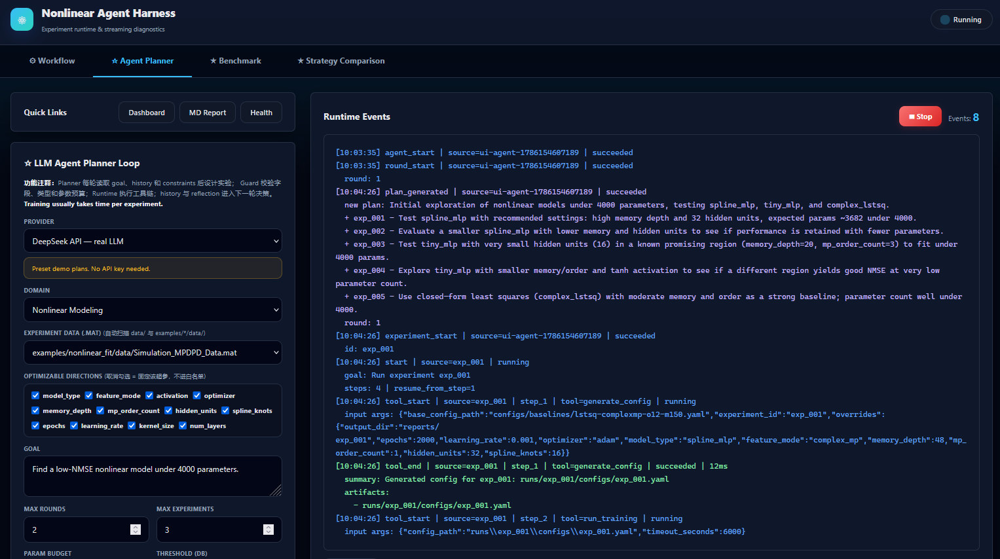

Benchmark 页签（10-case 评估，含 planner 成功率、自我修正、token/成本指标）：

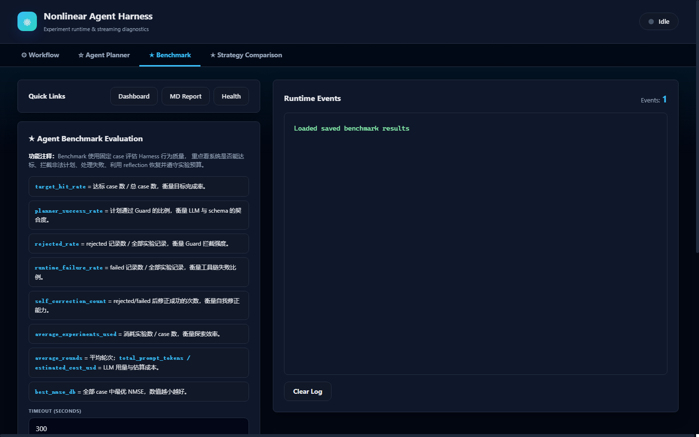

可优化方向白名单（3.0）：勾选/取消勾选可寻优的模型与超参方向，实时更新 Guard 白名单与 LLM 设计空间（未勾选的方向被固定、不再被搜索）：

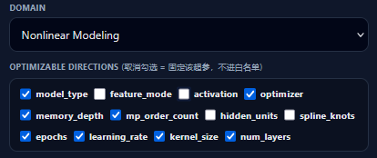

Agent Loop 实际运行的 SSE 事件日志（plan → tool → metric → complete 实时流）：

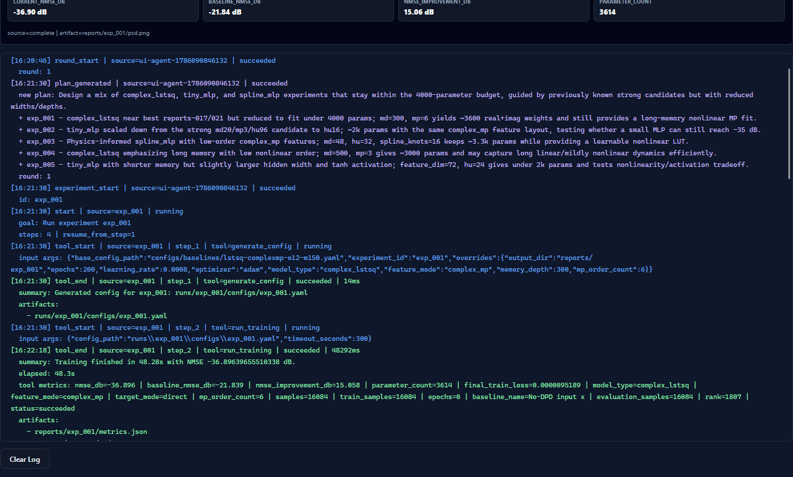

Strategy Comparison 页签（四策略对照，含 95% CI 与 paired delta）：

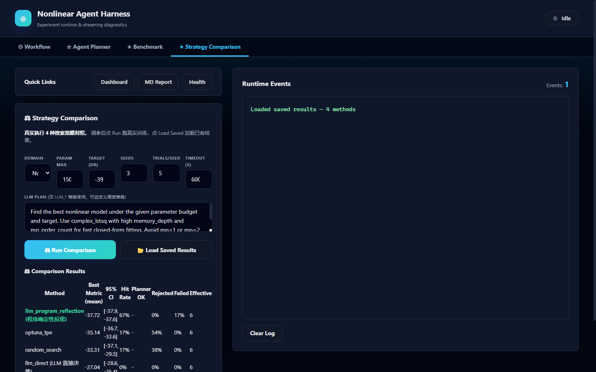

本地诊断 Dashboard（聚合全部实验指标、错误分布与策略对照）：

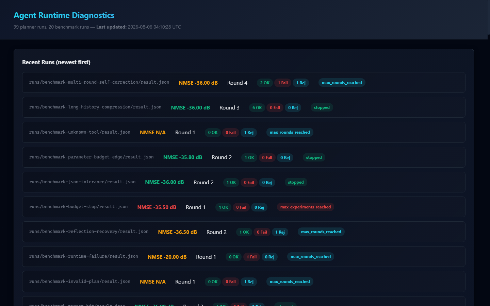

## 核心特性

- **Planner / Runtime 解耦**：LLM 只输出结构化 JSON 实验计划，不直接执行命令；Runtime 只调用已注册工具
- **Schema Guard 与预算控制**：白名单字段校验、结果字段黑名单、参数预算估算、`model_type` 白名单；被拒计划单独统计并回喂给 LLM 自动修正
- **可定制可优化方向（3.0）**：Web UI 可逐个开启/关闭可优化的模型与超参方向（模型族 `model_type`、卷积核 `kernel_size`、层数 `num_layers`、`learning_rate`、`scheduler`、`epochs` 等），开关实时更新 Guard 白名单与 LLM 设计空间——关闭的方向被固定，只搜开启的方向
- **DomainPlugin 可迁移**：非线性建模与合成回归两个领域插件共用同一套 Harness，证明系统可迁移
- **四种搜索策略统一对照**：`random_search`、`optuna_tpe`、`llm_direct`（LLM 直接决策，无反思）、`llm_program_reflection`（程序基于实验结果做确定性反思/路由）在同一协议、同一数据划分下公平比较，输出 bootstrap 95% CI 与 paired delta
- **历史先验注入**：把历史最优候选（-42 dB 级）作为知识注入 Reflection 策略，让 LLM 在已知最优邻域继续搜索
- **SSE 实时观测**：事件 ID、15 秒心跳、`/cancel`、Last-Event-ID 断线重放
- **SQLite 控制面**：请求去重、任务 lease、原子 claim、单调事件序列（WAL + busy timeout），并发压测通过
- **层级 Trace**：`trace_id/span_id/parent_span_id/attempt/model/config_hash/token/cost` 全链路
- **Web UI + CLI + Dashboard** 三套交付面，浏览器一键跑实验并实时看事件流

## 内置实验领域（3.1）

Web UI 的 Agent Planner 可直接切换以下领域，且自动扫描 `data/` 与 `examples/*/data/` 下的 `.mat` 文件，在"Experiment Data"下拉框中选择本次实验的数据集：

| 领域 | 实验内容 | 可寻优参数 | 主指标 |
| --- | --- | --- | --- |
| Nonlinear Modeling | RF MPDPD 非线性建模 | model_type / memory_depth / learning_rate / kernel_size / num_layers 等 | nmse_db |
| PIM Cancellation | 三阶 PIM 对消：`tx(32×L)` 拟合 `rx(32×L)` | model_type / memory_depth / reg / normalize_power | res_db（残余，含参数量/每通道最大功率/参数分布等中间变量） |
| Register Config | 寄存器表单配置实验 | mu / optimizer(adam\|sgd) / data_choice / lut_choice | final_mse_db |
| Synthetic Regression | 合成回归演示 | degree / reg_strength | val_mse |

任务 Domain 与实验数据选择：

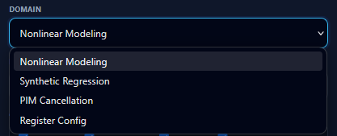

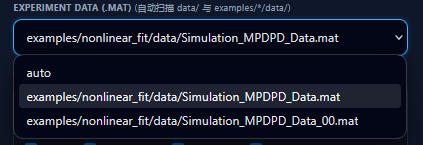

> 扩展接口：通过 `DomainPlugin` 接入新实验领域——实现 `design_space` / `validate_candidate` / `build_tool_registry` 等方法后，Planner、Guard、搜索策略与前端自动获得支持，无需改动 Harness 主链路；也可以用 `SimpleDomain`（设计空间 + 一个执行函数）零样板接入。

## 快速开始

环境要求：Python 3.9+，Windows / Linux / macOS。

```powershell
# 1. 安装依赖
pip install -r requirements.txt

# 2. 运行测试（确认环境正常）
python -m unittest discover tests

# 3. 离线跑一次完整 Agent Loop（无需 API Key）
python agent.py run --provider fake --max-rounds 2 --max-experiments 1 --artifact-dir runs\my-first-run

# 4. 启动 Web UI（浏览器打开 http://127.0.0.1:8000）
python agent.py serve --host 127.0.0.1 --port 8000
```

## 架构

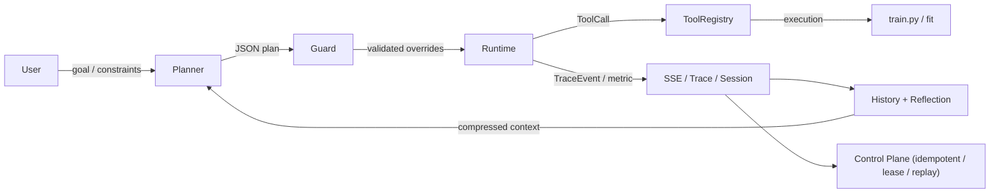
```mermaid
flowchart LR
    User -->|goal / constraints| Planner
    Planner -->|JSON plan| Guard
    Guard -->|validated overrides| Runtime
    Runtime -->|ToolCall| ToolRegistry
    ToolRegistry -->|execution| Train["train.py / fit"]
    Runtime -->|TraceEvent / metric| SSE["SSE / Trace / Session"]
    SSE --> History["History + Reflection"]
    History -->|compressed context| Planner
    SSE --> SQLite["Control Plane (idempotent / lease / replay)"]
```

核心模块：

| 模块 | 职责 |
| --- | --- |
| `planner.py` | 构造 prompt、解析 LLM 返回的 JSON 计划（容错 + few-shot + 字段契约） |
| `planner_validation.py` | Schema Guard：白名单/黑名单、类型、参数预算、别名规范化 |
| `loop.py` | 主循环：plan → validate → execute → observe → reflect，含被拒自动重试 |
| `runtime.py` | Harness Runtime：逐步执行工具链、事件流、session/trace |
| `tools.py` | ToolCall / ToolResult / ToolSpec / ToolRegistry |
| `domains/` | DomainPlugin 协议 + nonlinear-modeling / synthetic-regression 插件 |
| `search/` | SearchStrategy 协议 + Random / Optuna TPE / LLM 策略 |
| `evaluation_statistics.py` | bootstrap 95% CI、paired delta、summary 生成 |
| `control_plane.py` | SQLite 控制面（请求去重、任务 lease、事件序列） |
| `server.py` | FastAPI + SSE 服务层（含 Last-Event-ID 重放与取消） |
| `web_ui.py` / `dashboard.py` | 浏览器操作面板与诊断 Dashboard |

## 命令行速查

| 命令 | 用途 |
| --- | --- |
| `python agent.py run --provider fake` | 离线 Agent Loop（预设计划） |
| `python agent.py run --provider deepseek` | 真实 LLM Agent Loop（需 `DEEPSEEK_API_KEY`） |
| `python agent.py benchmark` | Agent 行为回归 Benchmark（离线 fake，默认 10 case） |
| `python examples\nonlinear_fit\run_benchmark.py --provider fake --case-count 50` | 参数化 **50-case** 对比（10 类型 × 5 阈值变体），[报告](docs/experiments/nonlinear-benchmark-50case.md) |
| `python examples\nonlinear_fit\run_benchmark.py --provider deepseek` | 真实 LLM + 真实训练的 Benchmark（可 `--case-count` 扩展） |
| `python agent.py compare-search` | 四种搜索策略真实对照 |
| `python agent.py stress-runtime` | SQLite 控制面并发压测 |
| `python agent.py serve` | 启动 Web UI / SSE 服务 |
| `python agent.py dashboard` | 生成诊断 Dashboard |

## 实验任务：非线性系统建模与对消

项目解决的信号处理问题：射频非线性系统（记忆多项式 MPDPD）的输入 `x` 经系统产生带非线性失真的输出 `d`。任务是学习系统的校正模型，使校正后的信号逼近理想目标 `d`——即**非线性对消 / 线性化**。

**指标 NMSE（归一化均方误差，dB）**：

```text
NMSE = 10 * log10( mean(|prediction - target|^2) / mean(|target|^2) )
```

- `baseline NMSE`：不建模时输入 `x` 相对目标 `d` 的误差（未对消）
- `current NMSE`：MPDPD 模型输出相对目标的误差（对消后）
- 提升量 = baseline − current（越大越好）

**频谱证据**：PSD 图中校正后信号（绿线）与目标（橙线）重合得越好，说明非线性失真被对消得越干净：

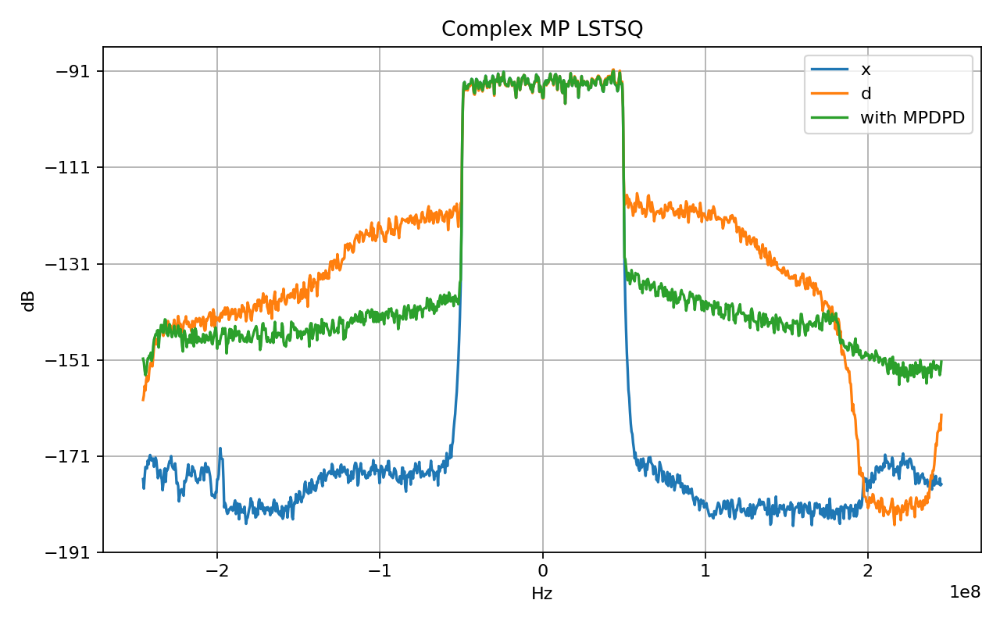

**代表性实验结果**：

| 实验 | 模型 | 关键参数 | 参数量 | NMSE (dB) | 来源 |
| --- | --- | --- | ---: | ---: | --- |
| exp016 | complex_lstsq | mem=220 mp=9 | 3980 | -37.49 | LLM 规划 run |
| tiny_md20_mp3_hu96 | tiny_mlp | mem=20 mp=3 hu=96 relu **epochs=10000** | 12386 | **-42.26** | 历史最优 |
| exp_492 | spline_mlp | mem=40 mp=1 hu=180 silu epochs=4000 | 21062 | -41.99 | 历史最优 |
| v26 LLM 设计 | tiny_mlp | mem=16 mp=3 hu=128 silu **epochs=20000** | 19490 | **-42.43** | 真实 LLM benchmark |

**为什么同时存在 -37 dB 与 -42 dB 两类结果（两套实验的边界）**：

- 搜索对照矩阵（`compare-search`）使用**离线模拟 LLM**（邻域采样，token=0），且为避免全矩阵训练爆炸，过滤了超长训练候选（epochs>2000），因此该矩阵只探索到 complex_lstsq 平台区（-37~-38 dB）——它回答"固定预算下哪种搜索策略更高效"；
- 真实 LLM benchmark（36000s 训练预算）允许 epochs=10000+ 的神经模型长训练，才到达 -42 dB 区——它回答"真实 LLM 在足够预算下能否找到历史最优区域并继续改进"。

## 实验证据

### 搜索策略对照（真实训练）

统一协议（`benchmarks/protocol/nonlinear-search-v1.json`）下，4 策略 × 5 seeds × 10 有效训练 trial，20000 参数预算：

| 方法 | best NMSE mean (dB) | target hit | rejected |
| --- | ---: | ---: | ---: |
| random_search | -36.02 | 10% | 32% |
| optuna_tpe | -37.02 | 22% | 35% |
| llm_direct | -33.59 | 28% | 10% |
| **llm_program_reflection（含历史先验）** | **-37.87** | **78%** | 24% |

Reflection 配对消融：**delta = -4.28 dB，95% CI [-10.0, -0.4]，显著**。

**策略命名语义**：

- `llm_direct`：LLM 直接根据目标/历史给出下一轮候选，不消费任何反思信息；
- `llm_program_reflection`：**程序针对实验结果做确定性反思与路由**——由 ReflectionPolicy 规则从结果中提取失败原因/事实，结合历史先验候选注入下一轮建议；
- LLM 自主反思（模型自己撰写反思并据此决策）是后续对照方向，当前版本以程序确定性反思为准。

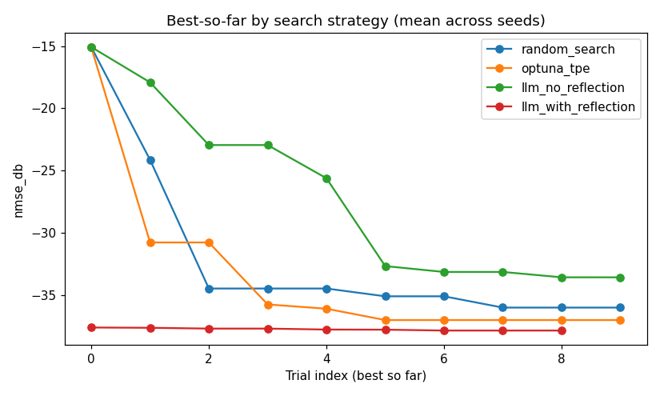

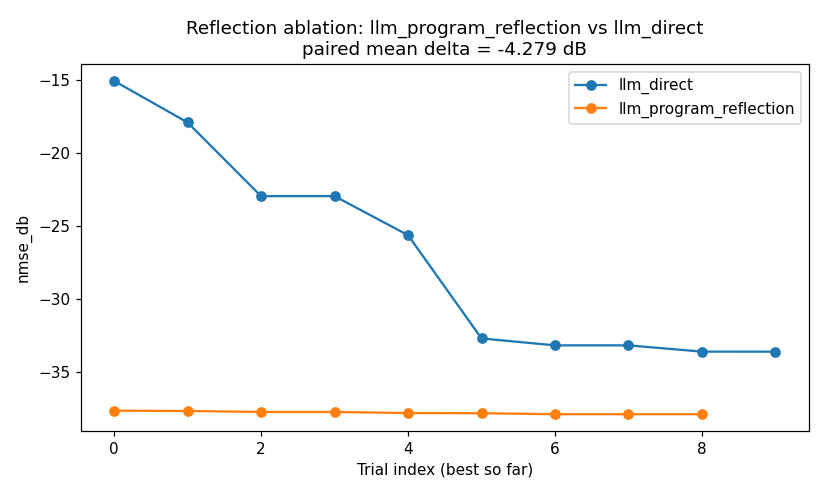

### 大规模策略对比（合成域，1000 trial）

把"固定预算下哪种搜索策略收敛更快"放大到 1000 trial（4 策略 × 5 seeds × 50 trial，合成回归域、真实计算、零 LLM 成本、零拒绝）。详见 [v3 报告](docs/experiments/nonlinear-search-ablation-v3.md)。

| 方法 | best val_mse mean | 平均收敛 trial（0-based） |
| --- | ---: | ---: |
| random_search | 0.0434 | 18.6 |
| optuna_tpe | 0.0434 | 13.4 |
| llm_direct | 0.0434 | **11.4** |
| **llm_program_reflection** | **0.0434** | **11.4** |

**LLM 式策略（邻域采样 + exploitation）收敛最快（11.4），Optuna 次之（13.4），Random 最慢（18.6）**。四策略最终都收敛到全局最优 0.0434——因为合成域只有 50 个合法组合、50 trial 无放回 ≈ 全枚举，真正的差异体现在收敛速度；本表早期版本中 Optuna 更差，根因是 Optuna 适配器把离散枚举当连续区间采样（已修复，详见 [v3 报告](docs/experiments/nonlinear-search-ablation-v3.md)）。合成域无历史先验可注入，reflection 与 direct 等价（paired delta = 0）——reflection 的增益来自知识注入，见上节真实非线性域 -4.28 dB 的显著提升。

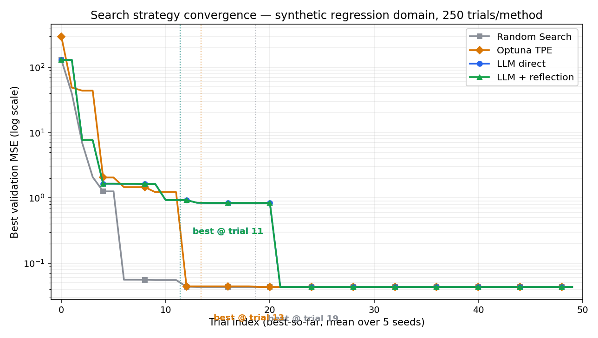

### 真实 API 策略对比（synthetic-large，400 组合空间）

把 LLM 策略换成**真实 DeepSeek 调用**（deepseek-v4-flash，prompt+Guard 重试+token/成本统计），并把空间放大到 20 degree × 20 reg = 400 组合（50 trial 只覆盖约 12%）。4 策略 × 5 seeds × 50 trial，LLM 总成本约 $0.34：

| 方法 | best val_mse | 平均收敛 trial | token 用量 | 成本 |
| --- | ---: | ---: | ---: | ---: |
| random_search | 0.0434 | 23.0 | 0 | $0 |
| optuna_tpe | 0.0434 | 26.2 | 0 | $0 |
| **llm_direct（真实 API）** | **0.0434** | **3.8** | 293,843 | $0.165 |
| **llm_program_reflection（真实 API）** | **0.0434** | **4.2** | 309,987 | $0.171 |

**真实 LLM 收敛快约 6 倍**：模型从 prompt 直接推理出"真函数是 degree-5、小正则最优"，首轮即给出 degree≈5 候选；Optuna/Random 需 20+ 次采样。flash 在 `json_object`+低温度下会输出空串，已通过关 json_mode、temperature=0.7、max_tokens=512 稳定到 3~6s/次（详见 [v3 报告](docs/experiments/nonlinear-search-ablation-v3.md)）。

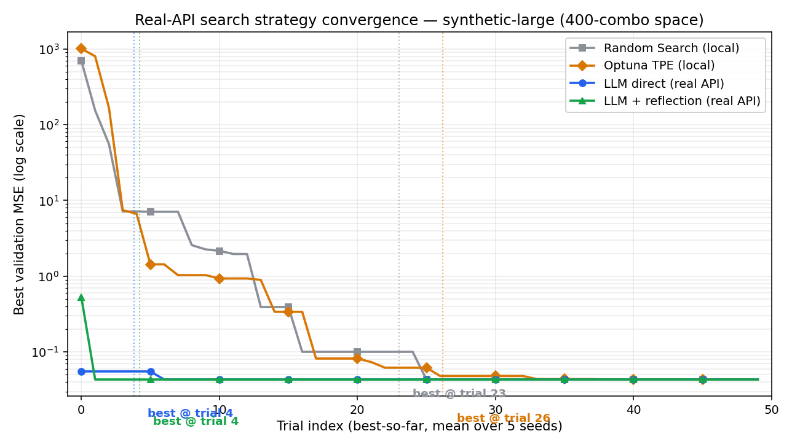

### 指标可视化

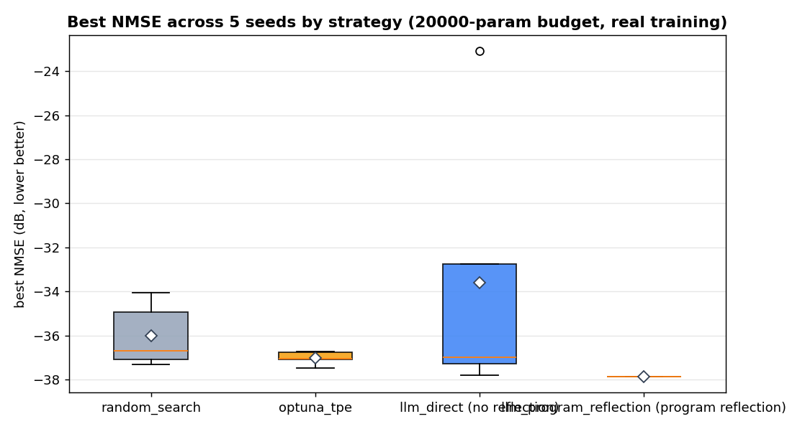

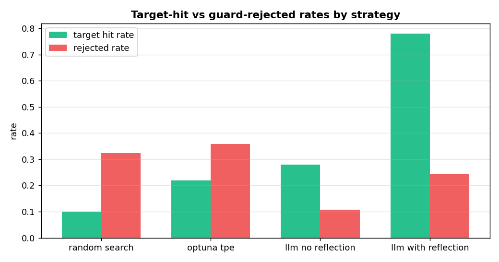

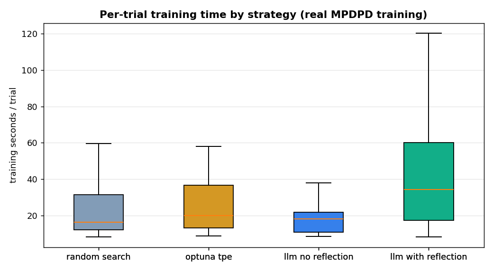

真实 LLM benchmark 逐 case：

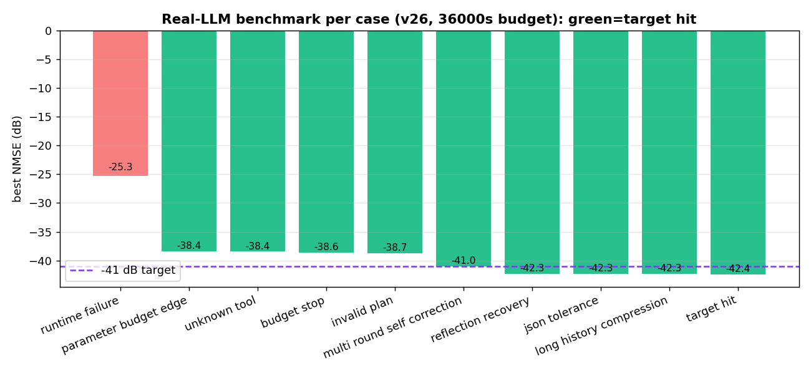

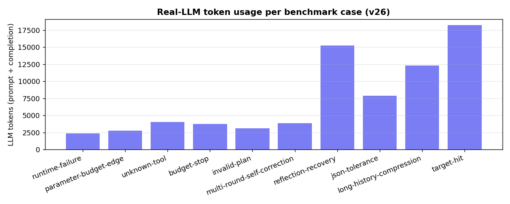

### 历史先验注入：达到 -42 dB

项目历史记录显示，达到 -41 dB 需要**神经模型长训练**（`tiny_mlp` + `epochs=10000` 等），而非 complex_lstsq 平台区。把这些候选写入 `configs/priors/nonlinear-modeling.json` 并注入 planner prompt 后，真实 DeepSeek 在已知最优邻域上继续搜索，设计出 **-42.43 dB**（tiny_mlp mem=16 / mp=3 / hu=128 / silu / epochs=20000）：


### Agent Benchmark（10 case）

指标：`target_hit_rate`、`rejected_rate`、`planner_success_rate`、`self_correction_count`、`runtime_failure_rate`、token/cost。

| 运行方式 | target_hit | rejected | best NMSE |
| --- | ---: | ---: | ---: |
| 离线 fake（确定性） | 0.7 | 21% | -36.5 |
| 真实 DeepSeek + 真实训练（v26） | **0.9** | **7.4%** | **-42.43** |

真实 LLM 运行结果与原始数据：

```text
benchmarks/deepseek-v26/results.json
benchmarks/fake-v21b/results.json
docs/experiments/nonlinear-search-ablation-v1.md
docs/experiments/nonlinear-search-ablation-v2.md
docs/experiments/nonlinear-search-ablation-v3.md
```

## 可靠性压测

```powershell
python agent.py stress-runtime --concurrency 8 --requests 100 --failure-rate 0.1 --output-dir benchmarks/runtime-v2
```

验收线（本地单进程 SQLite 基线）：重复执行率 0、事件丢失率 0、终态一致率 1.0、注入 10% 故障后恢复率 ≥ 0.95。

## 目录结构

```text
src/nonlinear_agent/       核心包（planner/guard/loop/runtime/tools/domains/search/eval/control-plane/server/web-ui）
examples/nonlinear_fit/    可运行入口（train.py / run_harness.py / run_benchmark.py / serve）
configs/                   基础配置（baselines/、examples/、priors/）
benchmarks/                实验与 Benchmark 产物（trials/summary/PNG/stress）
docs/                      UI 截图、实验报告、交接文档
tests/                     单元测试（230+）
```

## 复现与验证

```powershell
python -m unittest discover tests
python agent.py benchmark --output-dir benchmarks/fake-v21b
python agent.py compare-search --protocol benchmarks/protocol/nonlinear-search-v1.json --output-dir benchmarks/nonlinear-search-v1-v20000
python agent.py compare-search --domain synthetic --methods random_search,optuna_tpe,llm_direct,llm_program_reflection --seeds 7,17,29,43,61 --trial-budget 50 --parameter-count-max 100 --output-dir benchmarks/synthetic-compare-v1000
python agent.py compare-search --domain synthetic-large --llm-provider deepseek --seeds 7,17,29,43,61 --trial-budget 50 --parameter-count-max 100 --output-dir benchmarks/synthetic-real-v1000
python agent.py stress-runtime --concurrency 8 --requests 100 --failure-rate 0.1 --output-dir benchmarks/runtime-v2
```

所有实验产物（trials.jsonl / summary.json / summary.csv / PNG）都随仓库提交，任何结论都可以从原始数据复算。

## 文档

- 实验报告：[v1 搜索对照](docs/experiments/nonlinear-search-ablation-v1.md) · [v2 先验注入与 Benchmark 成熟化](docs/experiments/nonlinear-search-ablation-v2.md) · [v3 合成域 1000-trial 策略对比](docs/experiments/nonlinear-search-ablation-v3.md)
- 学习文档：[docs/learning/](docs/learning/)

## 设计借鉴与原创性

系统化借鉴了业界成熟方法，但实现均为本项目原创：

| 借鉴来源 | 借鉴点 | 本项目落地 |
| --- | --- | --- |
| Hermes（Nous Research） | `<tools>` 内函数签名 + 精确 JSON schema | planner prompt 内置"必须照填的 JSON 模板"与字段契约 |
| Claude Code / Claude | structured outputs、system prompt 格式契约、tool-result 错误回馈 | 强化 system prompt + Guard 拒绝后带错误重试（每轮限频 1 次） |
| 通用 Agent 工程 | plan → execute → observe → reflect 循环 | 完整主循环 + 历史压缩 + Reflection 事实提取 |

原创部分：**DomainPlugin 领域解耦**、**统一 Trial Protocol 与 bootstrap 统计**、**历史先验注入（-42 dB 候选）**、**SQLite 控制面**（幂等 / lease / SSE 重放）、**10-case Benchmark 指标体系**与**并发压测验收线**。
