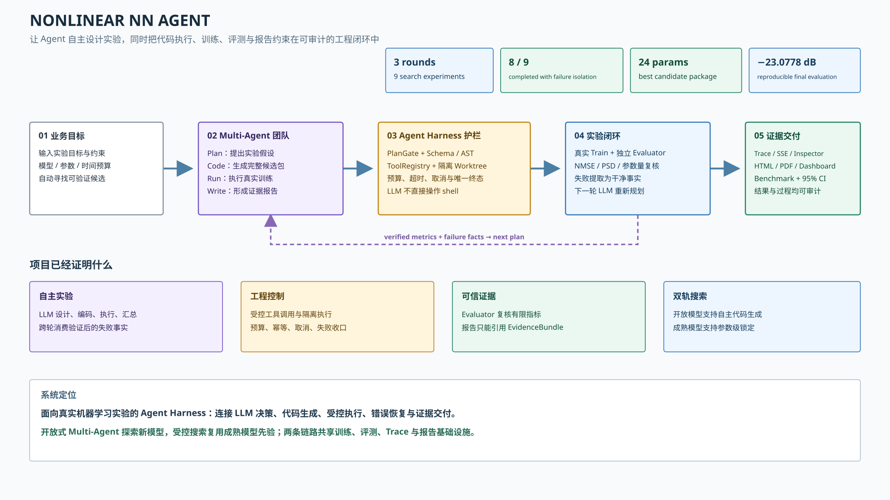
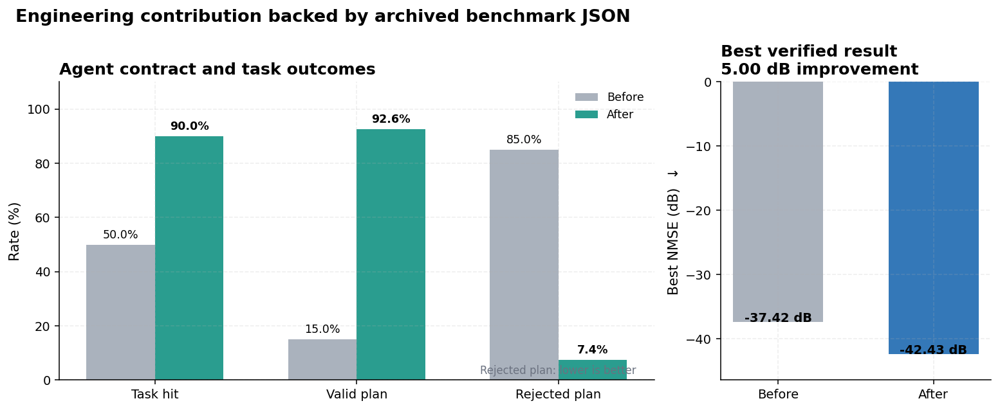
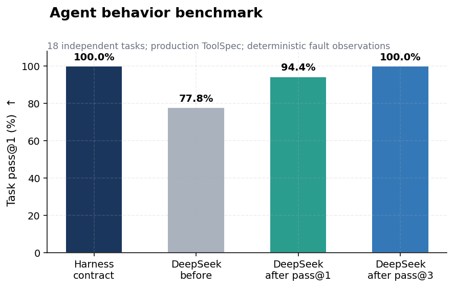
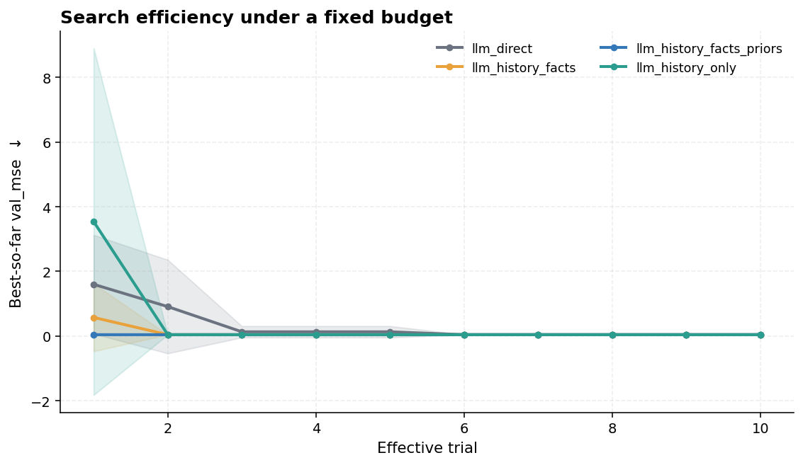
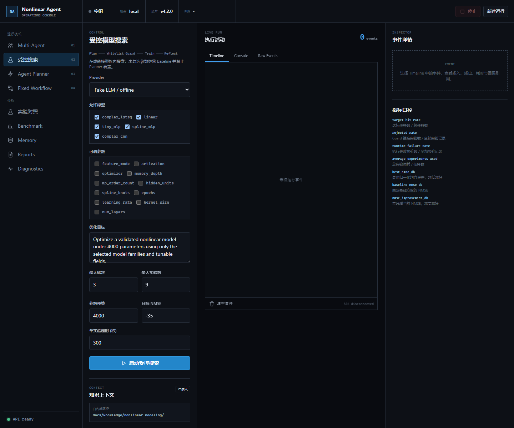
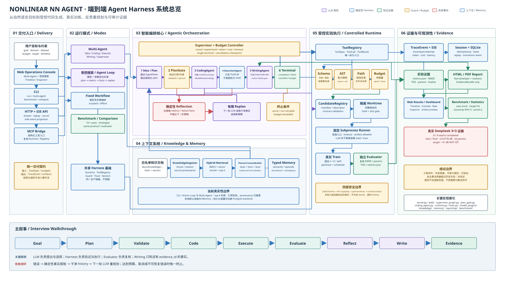

# Nonlinear NN Agent Harness

面向真实机器学习实验的 Agent Harness：让 LLM 设计实验、生成候选代码并根据验证事实迭代，同时由确定性运行时负责安全校验、真实训练、指标复核、过程观测和证据报告。

当前版本：`v4.4.0`。系统同时提供开放式 Multi-Agent 研究链路、稳定的受控模型搜索链路与可复算的 Evidence Benchmark，覆盖从实验构思、代码生成到训练评测、行为评估和证据交付的完整过程。

## 项目总览

[编辑系统概览 Draw.io](docs/assets/architecture/nonlinear-agent-executive.drawio) · [编辑工程详细图 Draw.io](docs/assets/architecture/nonlinear-agent-system.drawio) · [打开详细版 SVG](docs/assets/architecture/nonlinear-agent-system.svg)

[](docs/assets/architecture/nonlinear-agent-executive.svg)

这套系统将 LLM 的实验决策接入可控、可恢复、可观测、可复算的工程链路：

1. **自主实验**：PlanAgent 提出假设，CodingAgent 生成完整候选包，ExecutionAgent 执行真实训练，WritingAgent 汇总证据。
2. **确定性护栏**：PlanGate、Schema/AST/path gate、ToolRegistry、隔离 worktree、预算和超时共同约束模型行为。
3. **证据闭环**：Evaluator 复核 NMSE、参数量与 PSD；Reflection 只提取事实，下一轮 LLM 再选择策略；报告只能引用已有 `evidence_id`。
4. **双轨搜索**：开放式 Multi-Agent 负责探索新模型；受控搜索在成熟模型白名单内优化，模型与参数字段均可锁定。

## 当前能力

| 能力 | 状态 | 真实性边界 |
| --- | --- | --- |
| Multi-Agent Supervisor | 已接通 | `Idea/Plan → PlanGate → Coding → Execution → Writing → Terminal` 共用结构化 state |
| LLM Coding 闭环 | 已接通 | 输出完整 candidate package，经 JSON、路径、AST、契约与 smoke-training gate 后才可运行 |
| 真实训练与独立评测 | 已接通 | ExecutionAgent 只调用注册工具；Evaluator 复核有限指标和 artifact 路径 |
| Reflection 与重规划 | 已接通 | 程序只提取 metrics/failure facts，不用 `if` 规则替 LLM 决定下一步 |
| Trace 与控制面 | 已接通 | SSE、层级 trace、SQLite 幂等/lease/replay、取消与唯一终态 |
| WritingAgent 报告 | 已接通 | HTML/PDF 共用 `EvidenceBundle`；未知引用和不存在的数字会被拒绝 |
| Knowledge / typed Memory | 已接通 | Multi-Agent 每轮只注入白名单 top-k evidence；PlanGate 拒绝伪造引用；执行结果写回 typed episodic memory |
| 受控模型搜索 | 已接通 | 可选择允许的固定模型族和可调参数；未开放字段继承 baseline，越权覆盖由 Guard 拒绝 |
| 开放模型探索 | 已验证 | 真实 3×3 run 完成跨轮代码生成与独立终评，为后续知识增强和模型路由优化提供可复现实验基线 |

## 量化证据

`v4.3.0` 将 Agent 行为、搜索质量和运行时可靠性拆成独立协议。所有图表由原始 JSON/JSONL 生成，避免把 scripted fixture、真实 LLM 推理和模型训练性能混为一个总分。

### 工程改动带来了什么

下图从仓库已有的 `deepseek-v21-final` 与 `deepseek-v26` 原始结果复算。修复 Domain 上下文未注入、结构化输出契约和训练超时传递后，10-case 真实 DeepSeek 运行中：

- 目标命中率从 **50.0% 提升到 90.0%**；
- Planner 合法率从 **15.0% 提升到 92.6%**；
- 非法计划占比从 **85.0% 降到 7.4%**；
- 最佳验证 NMSE 从 **-37.42 dB 改善到 -42.43 dB**，提升 **5.00 dB**。



这些数据证明的是特定版本改动在固定项目协议中的效果，不代表通用 Agent 排行榜成绩。

### 真实 Agent 行为评测

行为集包含18个语义独立的 `nonlinear-modeling` 任务，覆盖 ToolSpec 参数契约、故障恢复、因果引用、工具顺序、预算停止、历史证据、Reflection Facts 和压缩上下文。确定性故障环境固定 observation，真实 DeepSeek 只负责逐步选择工具或停止，因此结果衡量 Planner 决策，不受神经网络训练随机性干扰。

| 协议 | 任务/尝试 | pass@1 | pass@3 | 结论边界 |
| --- | ---: | ---: | ---: | --- |
| Scripted contract regression | 18 / 54 | **100.0%** | 100.0% | 只证明 Harness 契约，无 LLM 推理结论 |
| DeepSeek 改进前 | 18 / 18 | **77.8%** | - | 暴露过度执行和终态不明确问题 |
| DeepSeek 改进后 | 18 / 54 | **94.4%** | **100.0%** | 同模型、同 ToolSpec、同评分器下复测 |



本轮改进增加了显式停止/去重契约、Planner坏JSON事实化和初始故障证据注入。正式复测记录约 **226k prompt tokens + 345k completion tokens**。其中两个任务曾因评分协议没有把初始已验证指标载入 state 而被误判；修复后仅增量重跑受影响任务，并在合并结果中保留 `correction_provenance`，没有覆盖原始错误评分文件。

### 搜索策略消融

真实 DeepSeek 消融采用 `synthetic-hard` 的2500组合空间，四组策略共享模型、3个 seeds、每组每 seed 10个有效 trial：

| 方法 | 有效 trial | Target hit | 观察 |
| --- | ---: | ---: | --- |
| Direct | 30 | 33.3% | 无历史上下文 |
| + History | 30 | 43.3% | 命中率增加10个百分点 |
| + History + Facts | 30 | 40.0% | Facts 独立增量不显著 |
| + History + Facts + Priors | 30 | **53.3%** | 命中率最高，但最终 best 增量未显著 |



结论是：当前 Knowledge/Priors 主要提高**命中频率和搜索效率**，尚不能证明其显著改善最终最优值；不能再把历史上的 `-4.28 dB` 混杂消融单独归因给 Reflection。

### 运行时可靠性

SQLite 控制面在 `concurrency=8`、300请求和15%故障注入下完成测试：重复执行率 **0%**、事件丢失率 **0%**、唯一终态一致率 **100%**，45个注入故障恢复率 **100%**。这是本地单进程可靠性基线，不外推为分布式生产SLA。

[Evidence 汇总 JSON](docs/assets/evidence/v1/evidence-summary.json) · [Evidence 报告](docs/assets/evidence/v1/evidence-report.md)

## 真实运行证据

一次连续 DeepSeek run 使用 `deepseek-chat` 承担 Idea/Plan、Coding 和 Writing，执行 3 round × 3 search experiments，并对全局最优候选独立终评。约束为固定 MPDPD 数据契约、`seed=42`、单候选不超过 4000 参数、epoch 不超过 50。

| 阶段 | 最佳候选 | 完成情况 | 最佳 NMSE | 参数量 |
| --- | --- | ---: | ---: | ---: |
| Round 1 | ComplexRational | 2/3 | -0.0474 dB | 146 |
| Round 2 | ComplexRationalV2 | 3/3 | -0.0272 dB | 34 |
| Round 3 | LUTSplineV3 | 3/3 | **-23.0778 dB** | **24** |
| Independent final | LUTSplineV3 | completed | **-23.0778 dB** | **24** |

总计 `8/9` 个搜索候选完成。该运行完整验证了候选代码生成、失败隔离、跨轮事实反馈、独立终评和报告收口。最佳候选达到 `-23.0778 dB / 24 params`；`-41 dB` 继续作为后续算法优化目标，成熟历史先验由受控搜索链路保留并可直接复用。

`v4.4.0` 又执行了一次最小真实 API 回归：DeepSeek 生成的新 `mlp_tanh_2x8` 候选在第 1 次 Coding 尝试即通过路径、AST、插件契约、参数预算和 smoke-training gate；ExecutionAgent 随后以固定工具完成独立执行，得到 `-20.1689 dB / 162 params`。WritingAgent 的两次草稿均经过 section-scoped evidence fidelity 检查；即使模型持续输出不合规叙述，确定性保底报告仍只使用已登记引用和可验证事实，使 6 阶段 timeline 最终以 `completed` 收口。该回归证明的是运行时兼容性与故障降级能力，不把单次 NMSE 当作算法质量结论。

[完整 6 页 PDF 报告](docs/reports/v4.0.0-e-deepseek-3x3-report.pdf) · [九次实验 NMSE](docs/assets/results/v4.0.0-e/nine-experiment-nmse.png) · [最终模型架构](docs/assets/results/v4.0.0-e/architecture.png)


## 快速开始

环境要求：Python 3.9+，Windows / Linux / macOS。

```powershell
# 安装
pip install -r requirements.txt

# 离线跑一次 Agent Loop，不需要 API Key
python agent.py run --provider fake --max-rounds 2 --max-experiments 1 --artifact-dir runs\quickstart

# 启动 Web Operations Console
python agent.py serve --host 127.0.0.1 --port 8000

# 快速回归测试
python scripts/run_tests.py fast
```

真实模型调用使用环境变量，例如 `DEEPSEEK_API_KEY`；不要把密钥写进命令、配置文件、trace 或 Git。

## Operations Console

Web 首页默认进入 Multi-Agent。中栏的 Timeline、Console、Raw Events 来自同一 SSE 事件流；点击事件后，右侧 Inspector 展示 role、model、token、cost、latency、输入/输出引用和失败事实。



页面还包含受控搜索、Agent Planner、Fixed Workflow、Experiments、Benchmark、Memory、Reports 与 Diagnostics。受控搜索可分别选择模型白名单和可调参数；Knowledge 面板可以启停 Multi-Agent 注入、调整 top-k，并预览白名单来源。Idea/Plan 事件会在 Inspector 中显示 evidence ID、citation、hash、score 和 memory provenance。

`v4.4.0` 统一了两条搜索链路的结果视图：Multi-Agent 显示候选数、Coding gate 通过数、修复尝试、执行成功数、目标命中和独立终评；受控搜索显示实验总数、完成/拒绝/运行失败、目标命中、最优 NMSE、输入基线、增益和参数量。结果行只消费真实 `experiment_end` 或 Multi-Agent execution 事件，不再把 Planner 的待执行计划误画成空白实验。

回归覆盖包括 `508` 项完整测试；另有真实 DeepSeek 最小链路验证 Coding、Execution、Writing 与 terminal 状态，而不是仅依赖 scripted fixture。

实验策略对照以 `random_search` 为参照组，在相同 domain、seed、trial budget、参数上限和目标阈值下比较 Optuna TPE、LLM Direct 与 LLM + Program Reflection；表格给出相对参照组增量，配对区域显示 treatment-control、样本数和显著性。

## 工程详细图

<details open>
<summary>端到端工程架构图</summary>

[打开可缩放 SVG](docs/assets/architecture/nonlinear-agent-system.svg) · [打开 3200×1800 PNG](docs/assets/architecture/nonlinear-agent-system.png)

[](docs/assets/architecture/nonlinear-agent-system.svg)

</details>

主成功流为：

```text
Goal → Plan → Validate → Code → Execute → Evaluate → Reflect → Write → Evidence
```

失败流只回传裁剪后的验证事实：

```text
schema / coding / runtime failure
  → deterministic fact extraction
  → clean planner history
  → next-round LLM strategy selection
  → retry within budget or single terminal
```

## 如何编辑架构图

两张图都不是位图模板，主要节点、区域和连线均为独立 Draw.io 图形：

1. 打开 [diagrams.net](https://app.diagrams.net/) 或 Draw.io Desktop。
2. 选择 `File → Open from → Device`。
3. 打开系统概览 `docs/assets/architecture/nonlinear-agent-executive.drawio`，或工程详细图 `docs/assets/architecture/nonlinear-agent-system.drawio`。
4. 修改节点和连线后，通过 `File → Export as → SVG / PNG` 导出展示文件；保留 `.drawio` 作为唯一可编辑源文件。

不要直接修改 PNG。README 默认展示 SVG，因为 SVG 在 GitHub 中可缩放且文字更清晰。

## 核心实现

| 模块 | 职责 |
| --- | --- |
| `supervisor_graph.py` | Multi-Agent 状态机、角色 handoff、预算、重规划与唯一终态 |
| `planner.py` / `plan_gate.py` | 结构化计划、引用和约束验证、rejected facts |
| `coding_agent.py` | 生成完整候选包，执行有限次数的事实驱动修复 |
| `model_plugins/` | `ModelPlugin`、`ModelDescriptor`、`CandidateRegistry` 与固定 runner |
| `execution_agent.py` / `runtime.py` | tool-only 执行、TraceEvent、session 与 artifact 发布 |
| `tools.py` | `ToolSpec`、`ToolCall`、`ToolResult` 和 `ToolRegistry` |
| `reflection.py` / `loop.py` | 确定性事实提取及下一轮 planner history 注入 |
| `writing_agent.py` / `reporting/` | `EvidenceBundle`、citation fidelity gate、HTML/PDF 报告 |
| `knowledge/` / `memory/` | 白名单知识摄入、混合检索、typed memory 与 provenance |
| `control_plane.py` | SQLite 幂等请求、lease、原子 claim 与事件重放 |
| `server.py` / `web/` | FastAPI、SSE 和无构建步骤的 Operations Console |
| `evaluation_statistics.py` | bootstrap 95% CI、paired delta 和策略汇总 |

## 实验领域

| Domain | 任务 | 主指标 |
| --- | --- | --- |
| Nonlinear Modeling | MPDPD 非线性建模与对消 | `nmse_db` |
| PIM Cancellation | 三阶 PIM 对消 | `res_db` |
| Register Config | 寄存器表单配置实验 | `final_mse_db` |
| Synthetic Regression | 可控合成回归评测 | `val_mse` |

通过 `DomainPlugin` 实现 `design_space`、`validate_candidate` 和 `build_tool_registry`，新领域可以复用 Planner、Guard、Runtime、Search、Trace 与 Web UI。

### NMSE 与 PSD

```text
NMSE = 10 * log10(mean(|prediction - target|²) / mean(|target|²))
```

NMSE 越低越好。PSD 图用于检查预测信号与目标信号在频域是否重合；搜索阶段的最佳值必须通过独立 final evaluation 才能进入最终报告。

## Benchmark 与验收

项目采用三层评测体系，分别验证 Agent 行为、搜索质量与运行时可靠性：

| 层级 | 回答的问题 | 主要指标 |
| --- | --- | --- |
| Agent behavior benchmark | Agent 是否正确计划、调用工具、消费失败事实并停止 | pass@k、planner success、causal correction、invalid action rate |
| Search comparison | 搜索策略在同一数据与预算下是否更有效 | best NMSE、target hit、rejected rate、bootstrap 95% CI、paired delta |
| Runtime stress | 控制面在并发和故障下注入是否可靠 | duplicate execution、event loss、terminal consistency、recovery rate |

Benchmark/Search 复用生产 `Guard`、`Runtime`、`ToolRegistry` 和 evaluator，不另外搭一条更容易通过的测试路径。

```powershell
python agent.py agent-benchmark --provider scripted --attempts 1 --output-dir benchmarks/agent-tasks-v1
python agent.py compare-search --protocol benchmarks/protocol/nonlinear-search-v1.json --output-dir benchmarks/nonlinear-search-v1-v20000
python agent.py stress-runtime --concurrency 8 --requests 100 --failure-rate 0.1 --output-dir benchmarks/runtime-v2

# 真实 LLM 行为评测（显式在线命令）
python agent.py agent-benchmark --provider deepseek --attempts 3 --output-dir benchmarks/evidence-v1/deepseek

# 四组正交真实搜索消融
python agent.py compare-search --domain synthetic-hard --methods llm_direct,llm_history_only,llm_history_facts,llm_history_facts_priors --seeds 7,17,29 --trial-budget 10 --parameter-count-max 100 --llm-provider deepseek --output-dir benchmarks/evidence-v1/search-deepseek

# 从原始结果重新生成报告与科研图
python agent.py evidence-pack --scripted-results benchmarks/evidence-v1/scripted/results.json --online-results benchmarks/evidence-v1/deepseek-after/results.json --online-correction benchmarks/evidence-v1/deepseek-protocol-correction/results.json --online-before benchmarks/evidence-v1/deepseek-smoke/results.json --search-dir benchmarks/evidence-v1/search-deepseek --stress-results benchmarks/evidence-v1/runtime/stress.json --before-results benchmarks/deepseek-v21-final/results.json --after-results benchmarks/deepseek-v26/results.json --output-dir docs/assets/evidence/v1
```

## 常用命令

| 命令 | 用途 |
| --- | --- |
| `python agent.py run --provider fake` | 离线 Agent Planner Loop |
| `python agent.py run --provider deepseek` | 真实 LLM Planner Loop |
| `python agent.py multi-agent --provider deepseek --rounds 3 --experiments-per-round 3 --final-evaluation --planner-context on --knowledge-top-k 3` | Multi-Agent 3×3 搜索、Knowledge/Memory 注入与独立终评 |
| Web `受控搜索` | 在固定模型族内按字段锁定或开放参数，复用 Agent Loop 与真实 Harness |
| `python agent.py benchmark` | 传统 Harness 行为回归 |
| `python agent.py agent-benchmark` | 独立 action-level Agent 任务评测 |
| `python agent.py evidence-pack` | 汇总行为、搜索、可靠性原始证据并生成科研图 |
| `python agent.py compare-search` | 四种搜索策略统一协议对照 |
| `python agent.py stress-runtime` | SQLite 控制面并发压测 |
| `python agent.py dashboard` | 生成离线诊断 Dashboard |

## 目录结构

```text
src/nonlinear_agent/       Agent、Harness、Guard、Memory、Knowledge、Report 与 Web 核心包
examples/nonlinear_fit/    非线性建模训练与评测入口
configs/                   baseline、example 与历史先验配置
benchmarks/                协议、逐 case 结果、统计摘要与压力测试证据
docs/                      学习文档、实验报告、交接说明和展示资源
tests/                     单元、集成、故障注入与 Web 契约测试
```

## 文档导航

- [新人上手指南](docs/onboarding/newcomer-guide.md)
- [最新学习文档 v1.6.2](docs/learning/experiment-agent-harness-v1.6.2.md)
- [真实 DeepSeek 3×3 PDF 报告](docs/reports/v4.0.0-e-deepseek-3x3-report.pdf)
- [独立 Agent 任务摘要](benchmarks/agent-tasks-v1/summary.md)
- [v4.3.0 Evidence Benchmark](docs/assets/evidence/v1/evidence-report.md)
- [搜索策略历史实验 v3](docs/experiments/nonlinear-search-ablation-v3.md)

## 演进方向

- 当前 Memory 默认使用进程内 LangGraph Store，服务重启后不会持久保留；生产部署应切换到已有的 Postgres backend。
- 对开放式模型生成执行同任务、同预算、同 seed 的 knowledge on/off 消融，量化 target hit、best NMSE、invalid plan、coding pass rate、token 和成本。
- Executor 仍应进一步强化从标准 prediction artifact 重算指标的能力，减少对候选自报字段的信任。
- 真实 LLM benchmark 成本较高；任何性能结论都应同时报告任务集、预算、seed、失败数、token 和成本。
