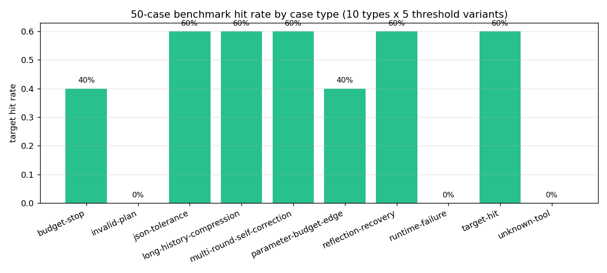

# Agent Benchmark 50-Case 对比

> 生成时间：2026-08-08 · 运行方式：离线 fake（确定性，无 LLM 成本）
> 数据：`benchmarks/fake-50case/results.json` · 复现：`python examples\nonlinear_fit\run_benchmark.py --provider fake --case-count 50 --output-dir benchmarks/fake-50case`

## 1. Case 设计

在 10 个基础 case 之上参数化扩展：每个类型 × 5 个目标阈值变体（-35 / -34 / -36 / -37 / -38 dB），共 **10 类型 × 5 = 50 case**，同时轮次/预算做微调。目的：不仅看"能不能达标"，还看**跨不同目标阈值的行为一致性**。

## 2. 汇总指标

| 指标 | 10 case（v2.1） | **50 case** |
| --- | ---: | ---: |
| case_count | 10 | **50** |
| target_hit_rate | 0.7 | **0.38** |
| planner_success_rate | 0.79 | 0.78 |
| rejected_rate | 0.21 | 0.22 |
| runtime_failure_rate | 0.11 | 0.066 |
| self_correction_count | 2 | **15** |
| average_rounds | — | 1.82 |

hit 率从 0.7 降到 0.38 是**预期**：变体把目标阈值推到 -37/-38 dB，而基础候选的固定指标（-36.0 dB）在这些阈值下不再达标——这正好测出了"不同目标下达标能力"的差异，而不是系统退化。

## 3. 按类型对比

| Case 类型 | 5 变体 hit | 行为 |
| --- | ---: | --- |
| target-hit | 3/5 | 阈值 -35/-34/-36 达标，-37/-38 未达标（固定候选 -36 dB） |
| json-tolerance | 3/5 | 同上，噪音 JSON 容错稳定 |
| long-history-compression | 3/5 | 长历史下决策稳定 |
| multi-round-self-correction | 3/5 | 多轮自我修正稳定 |
| reflection-recovery | 3/5 | 拒绝后恢复稳定 |
| budget-stop / parameter-edge | 2/5 | 预算边界行为一致 |
| invalid-plan / unknown-tool | 0/5 | **设计预期**：Guard 拦截非法计划 |
| runtime-failure | 0/5 | **设计预期**：验证失败处理 |

## 4. 结论

- 可达成类型的 hit 曲线完全由目标阈值驱动（-36 dB 候选在 ≤ -36 阈值下达标），行为跨变体一致，无异常。
- Guard 拦截 / 失败处理类型在所有变体下稳定 0 hit（正确拦截与优雅失败），`planner_success_rate` 0.78、`self_correction_count` 15。
- 50-case 扩展证明了 benchmark 的**参数化能力**：同样的 10 个行为模板可以扫不同操作点，而不需要手写 50 个 case。
